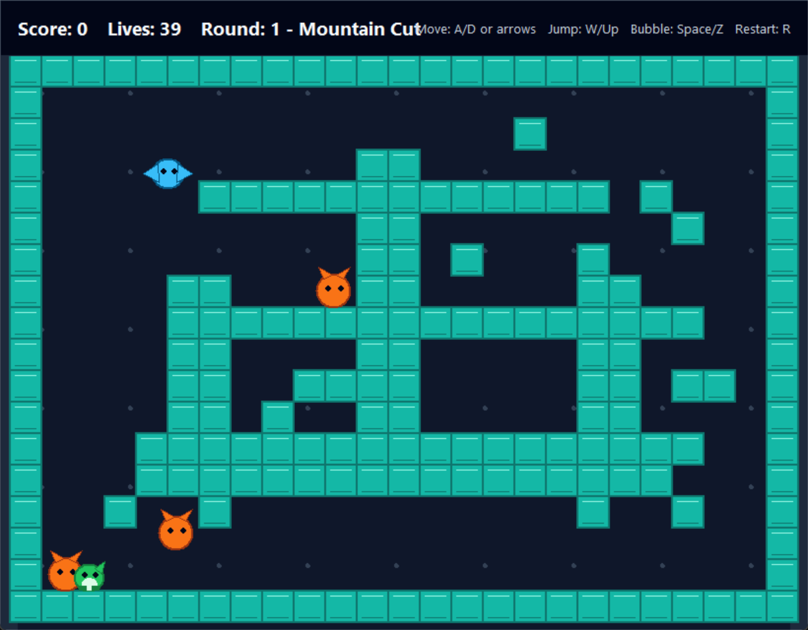
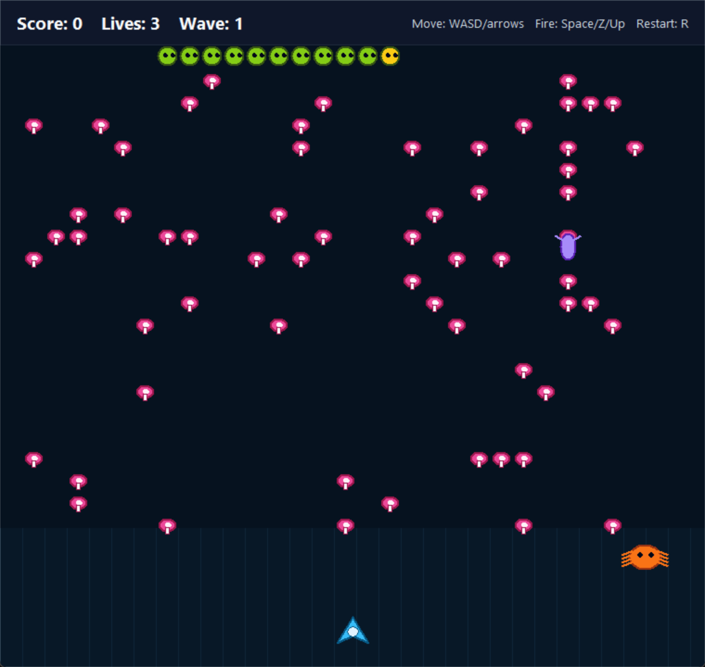
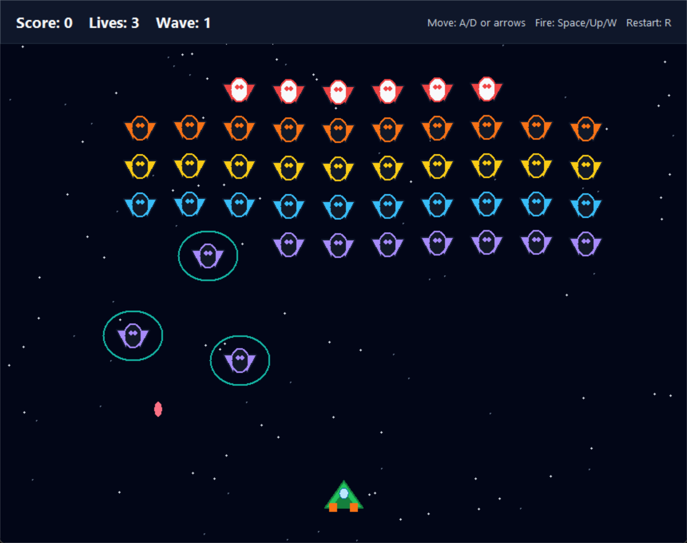
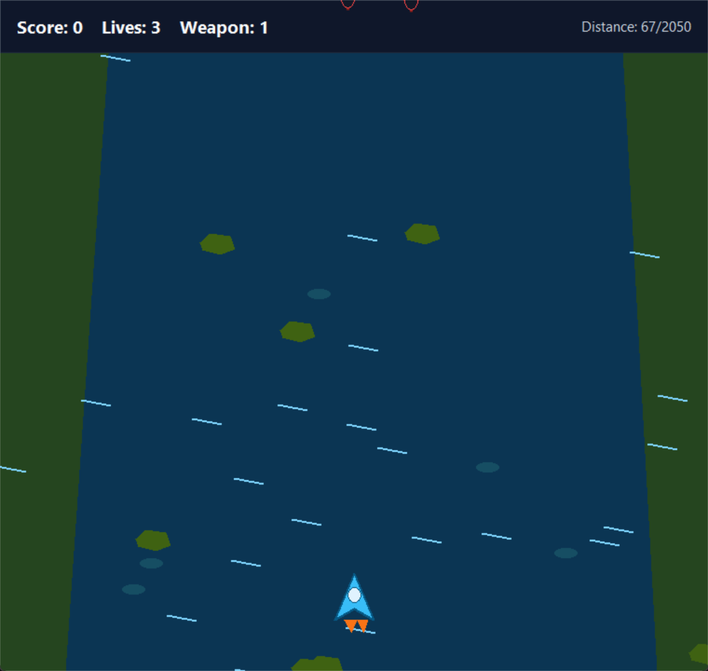

# VibeCodeArcade

VibeCodeArcade is a vibe-coded collection of small arcade-inspired games built as standalone Python Tkinter scripts. The goal is playful experimentation: classic arcade ideas, quick iteration, and readable scripts you can poke at.

## Games

- `bubble_vault_tkinter.py` - Bubble-trapping platform game
- `mushroom_march_tkinter.py` - Segmented crawler shooter
- `sky_armada_tkinter.py` - Fixed formation space shooter
- `pixel_runner_tkinter.py` - Side-scrolling platform runner
- `star_invaders_tkinter.py` - Starfield defense shooter
- `block_drop_tkinter.py` - Falling-block puzzle game
- `nebula_wings_tkinter.py` - Vertical scrolling space shooter

## Screenshots

### Bubble Vault



### Mushroom March



### Sky Armada



### Pixel Runner


### Star Invaders


### Block Drop


### Nebula Wings



## Requirements

- Python 3.10 or newer
- Tkinter, which is included with most standard Python installations
- Pillow, used by `bubble_vault_tkinter.py` to generate enhanced glyph-based levels from the bundled Noto Sans JP font

Install Python package dependencies with:

```powershell
pip install -r requirements.txt
```

## Running A Game

Each game is a standalone script. Run the one you want from the repository directory:

```powershell
python .\block_drop_tkinter.py
```

Replace `block_drop_tkinter.py` with any of the other game script filenames.

## Notes

Most games only use the Python standard library. If Pillow is not installed, `bubble_vault_tkinter.py` still runs using fallback level maps.

`bubble_vault_tkinter.py` uses `assets/fonts/NotoSansJP-Regular.otf` for glyph-based level generation, so it no longer depends on fonts installed in `C:\Windows\Fonts`. The bundled font is Noto Sans JP, licensed under the SIL Open Font License 1.1; see `assets/fonts/NotoSansJP-LICENSE.txt`.
