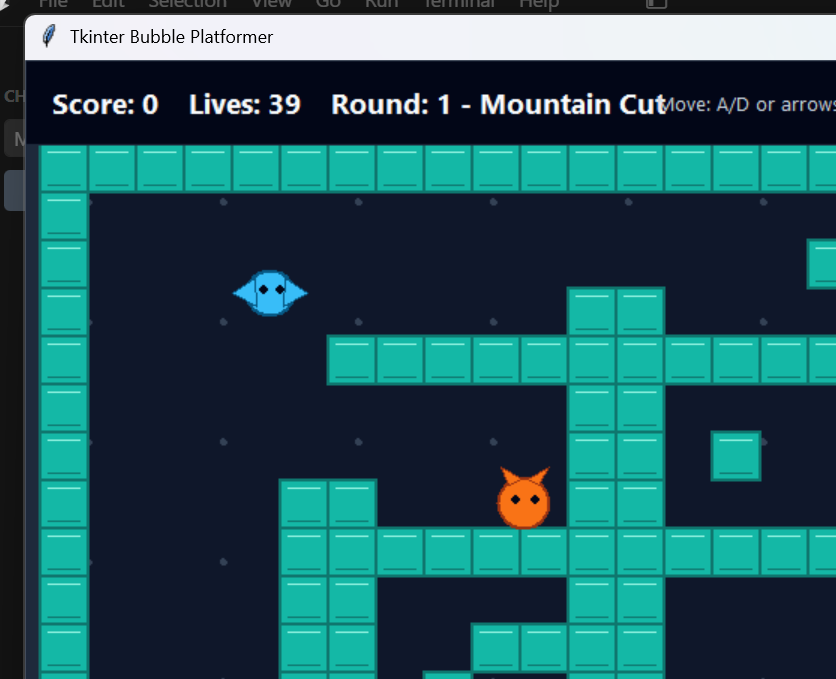
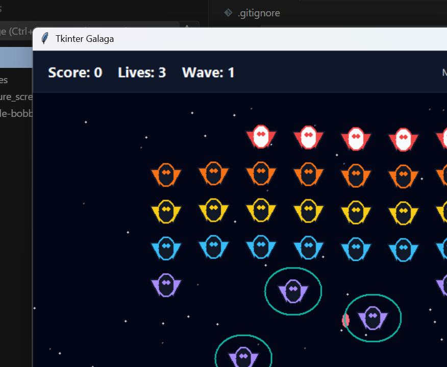
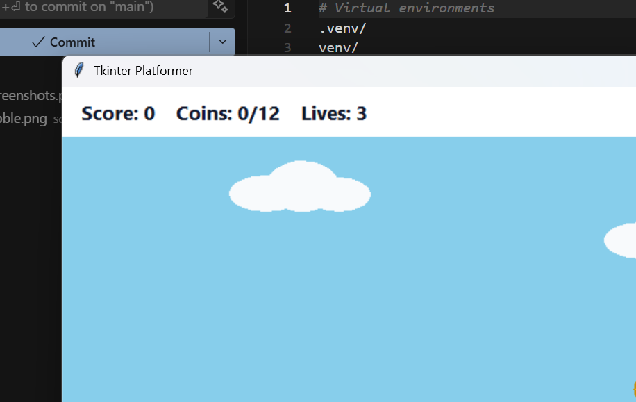
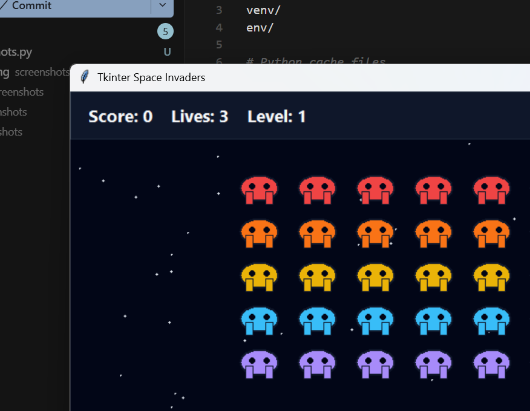
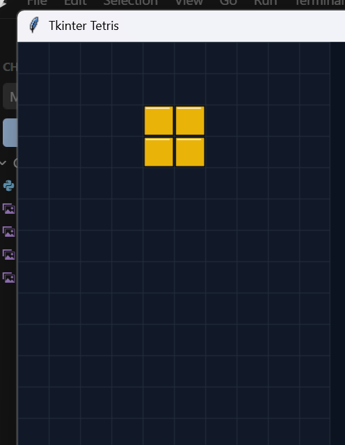
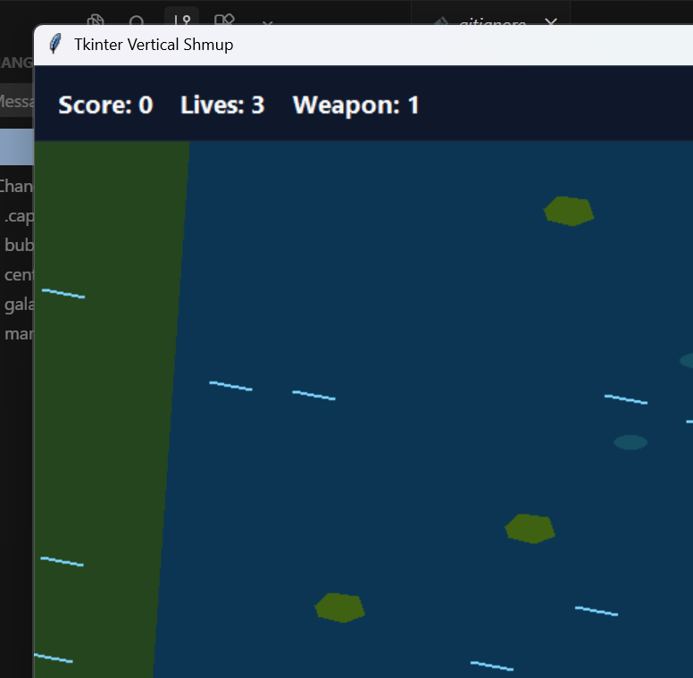

# VibeCodeArcade

VibeCodeArcade is a vibe-coded collection of small arcade-inspired games built as standalone Python Tkinter scripts. The goal is playful experimentation: classic arcade ideas, quick iteration, and readable scripts you can poke at.

## Games

- `bubble_bobble_tkinter.py` - Bubble Bobble-style platform game
- `centipede_tkinter.py` - Centipede-style shooter
- `galaga_tkinter.py` - Galaga-style shooter
- `mario_tkinter.py` - Mario-style side-scrolling platformer
- `space_invaders_tkinter.py` - Space Invaders-style shooter
- `tetris_tkinter.py` - Tetris
- `vertical_shmup_tkinter.py` - Vertical scrolling shoot 'em up

## Screenshots

### Bubble Bobble



### Centipede


### Galaga



### Mario



### Space Invaders



### Tetris



### Vertical Shmup



## Requirements

- Python 3.10 or newer
- Tkinter, which is included with most standard Python installations
- Pillow, used by `bubble_bobble_tkinter.py` to generate enhanced glyph-based levels

Install Python package dependencies with:

```powershell
pip install -r requirements.txt
```

## Running A Game

Each game is a standalone script. Run the one you want from the repository directory:

```powershell
python .\tetris_tkinter.py
```

Replace `tetris_tkinter.py` with any of the other game script filenames.

## Notes

Most games only use the Python standard library. If Pillow is not installed, `bubble_bobble_tkinter.py` still runs using fallback level maps.
